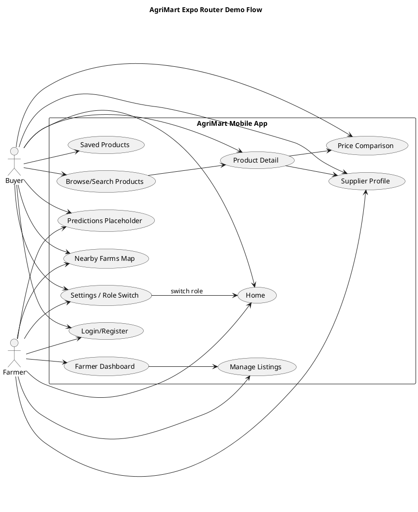
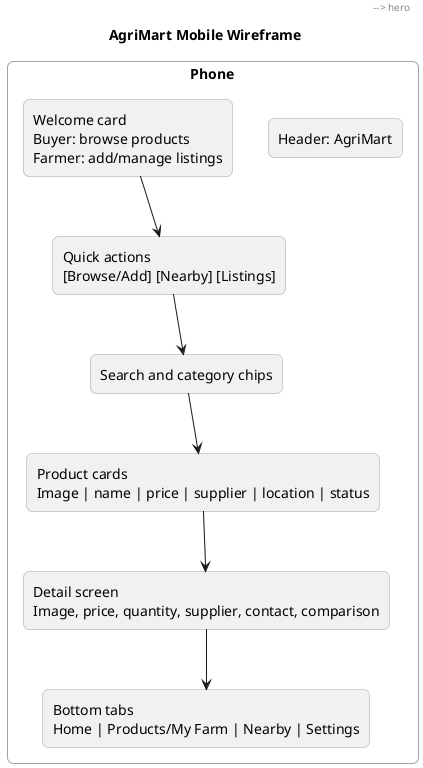

# AgriMart

AgriMart is an Expo SDK 54 mobile marketplace prototype for Zambian agricultural products. It lets a buyer browse produce, search and filter listings, compare current prices, view nearby suppliers, open supplier profiles, and contact farmers. It also lets a farmer/supplier simulate account access, add listings, manage their products, and mark stock as sold out.

This project is currently a simulated MVP. It uses mock data and in-memory state, so changes reset when the app reloads.

## Current Stack

| Area            | Current choice                                 |
| --------------- | ---------------------------------------------- |
| App framework   | Expo SDK 54                                    |
| Routing         | Expo Router                                    |
| Runtime         | React 19, React Native 0.81                    |
| Styling         | NativeWind / React Native CSS                  |
| Data            | Local mock data plus React context             |
| Maps            | Native WebView with Leaflet/OpenStreetMap HTML |
| Location        | `expo-location` foreground permission          |
| Image rendering | `expo-image`                                   |

## Development Setup With Expo Go

Expo SDK 54 requires Node.js 20.19.x or newer in the 20.x line. Expo Go is enough for the current app because the project uses Expo SDK packages and third-party packages that are supported in Expo Go. A custom development build is only needed later if the app adds unsupported native modules or custom native code.

1. Install Node.js.

   Use Node.js 20.19.x or a compatible newer LTS version.

2. Install dependencies.

   ```bash
   npm install
   ```

3. Install Expo Go on your phone.
   - Android: install Expo Go from Google Play.
   - iOS: install Expo Go from the App Store.

4. Start the development server.

   ```bash
   npm start
   ```

   This runs:

   ```bash
   expo start
   ```

5. Open the app in Expo Go.
   - Scan the QR code shown in the terminal.
   - Your phone and computer should usually be on the same Wi-Fi network.
   - If the QR code does not connect, use tunnel mode:

     ```bash
     npx expo start --tunnel
     ```

6. Optional platform shortcuts.

   ```bash
   npm run android
   npm run ios
   npm run web
   npm run lint
   ```

   Notes:
   - `npm run android` needs Android Studio/emulator if not using a physical device.
   - `npm run ios` needs macOS and Xcode.
   - `npm run web` runs the web version, but the current map screen intentionally shows a web fallback message because the implemented map is native-focused.

## Expo Go Notes

- The app is already on Expo SDK 54: `expo` is `~54.0.33`.
- Expo Router is configured through `expo-router/entry` in `package.json` and the `expo-router` plugin in `app.json`.
- Location permission text is configured in `app.json`.
- Remote product images and map tiles need an internet connection.
- Local product changes are not persisted. Refreshing the app restores the mock data.
- If the app appears stale, restart with cache clearing:

  ```bash
  npx expo start -c
  ```

## Simulating Buyer and Farmer Users

The login screen includes quick demo access buttons.

| Role            | Demo user                | What to test                                                                                                                                    |
| --------------- | ------------------------ | ----------------------------------------------------------------------------------------------------------------------------------------------- |
| Buyer/Consumer  | Joseph Phiri, Lusaka CBD | Browse products, search/filter, view details, compare prices, save products, open supplier profiles, call/WhatsApp suppliers, view nearby farms |
| Farmer/Supplier | Mwansa Chanda, Chongwe   | View farmer dashboard, add a product, manage listings, edit a listing, mark sold out, delete a listing                                          |

Manual demo login also works with the mock emails. The current demo login checks the email only, not the password.

| Role   | Email                |
| ------ | -------------------- |
| Farmer | `mwansa@agrimart.zm` |
| Buyer  | `joseph@email.zm`    |

You can also register a new mock account as either a buyer or farmer. Registration is in-memory only.

## Main Demo Flows

### Buyer Flow

1. Open the app in Expo Go.
2. Tap `Login as Buyer`.
3. Use `Home` to browse featured products and categories.
4. Open `Products` to search by product, category, supplier, or location.
5. Open a product detail page to view price, quantity, supplier, contact buttons, and comparison rows.
6. Use `Price Comparison` to compare products sold by multiple suppliers.
7. Use `Nearby` to request location permission and view supplier markers.
8. Use `Settings` to log out or switch role for simulation.

### Farmer Flow

1. Open the app in Expo Go.
2. Tap `Login as Farmer`.
3. Open `My Farm` to view listing statistics and recent listings.
4. Tap `Add New Product`.
5. Add name, category, price, quantity, unit, description, and location.
6. Open `Manage Listings`.
7. Edit a product, mark it sold out, or delete it.
8. Use `Settings` to switch to buyer mode or log out.

## Implemented Screens

| Route                              | Purpose                                        | Status                                            |
| ---------------------------------- | ---------------------------------------------- | ------------------------------------------------- |
| `app/(auth)/login.tsx`             | Login and quick demo access                    | Implemented as mock auth                          |
| `app/(auth)/register.tsx`          | Register buyer/farmer                          | Implemented as in-memory registration             |
| `app/(tabs)/(home)/index.tsx`      | Role-aware home screen                         | Implemented                                       |
| `app/(tabs)/(products)/index.tsx`  | Product list, search, category filter, sort    | Implemented with local data                       |
| `app/products/[id].tsx`            | Product details, contact, supplier, comparison | Implemented                                       |
| `app/price-compare.tsx`            | Compare same-name products across suppliers    | Implemented with local data                       |
| `app/(tabs)/(map)/index.tsx`       | Nearby supplier map                            | Implemented for native Expo Go; web fallback only |
| `app/suppliers/[id].tsx`           | Supplier profile and supplier products         | Implemented                                       |
| `app/(tabs)/(farmer)/index.tsx`    | Farmer dashboard                               | Implemented                                       |
| `app/products/create.tsx`          | Add product listing                            | Implemented with placeholder image upload         |
| `app/farmer/listings.tsx`          | Farmer product management                      | Implemented                                       |
| `app/farmer/edit-product/[id].tsx` | Edit listing and availability                  | Implemented                                       |
| `app/saved.tsx`                    | Saved product list                             | Implemented in memory                             |
| `app/predictions.tsx`              | ML prediction module screen                    | Placeholder only                                  |
| `app/(tabs)/(settings)/index.tsx`  | Profile display, role switch, logout           | Partially implemented                             |

## Objective Coverage

### Objective 1

Objective: develop a cross-platform agricultural marketplace that allows consumers to locate nearby suppliers and farmers, browse products, and compare current prices.

Current status: partially implemented as a mobile-first simulated MVP.

Implemented:

- Buyer and farmer demo flows.
- Product browsing with local mock products.
- Search by product name, supplier, category, and location.
- Category filtering for grains, vegetables, fruits, legumes, and tubers.
- Product details with image, price, unit, quantity, description, category, supplier, location, and availability.
- Current price comparison for same-name products.
- Supplier profile with contact details and supplier products.
- Call and WhatsApp actions through device linking.
- Native map view with user location request, default Lusaka fallback, and supplier markers.
- Farmer listing creation, editing, sold-out marking, and deletion.

Not fully implemented:

- Production backend, database, and APIs.
- Real authentication, password validation, password reset, OTP, or session persistence.
- Real image upload from camera/gallery.
- GPS capture while creating a listing.
- Distance calculation and nearest sorting.
- Product-specific map callouts that open product details directly.
- Full web map support.
- Admin dashboard and moderation.
- Reports and verification.
- Offline cache, retry flows, and robust network error handling.

### Objective 2

Objective: implement a machine learning prediction module that forecasts future product availability and price trends.

Current status: not implemented yet. The app only has a placeholder `Price Predictions` screen.

Implemented:

- A route and UI placeholder at `app/predictions.tsx`.
- Preview cards describing future price trend charts, future estimates, location-based analysis, and prediction notices.

Not implemented:

- Dataset collection or storage.
- Historical price tracking.
- Model training or inference.
- Availability forecasting.
- Prediction API.
- Product/location selectors for predictions.
- Trend graph with real forecast output.
- Confidence score or model explanation based on actual predictions.

## Functional Coverage Checklist

| Functional area               | Current status                                                                                              |
| ----------------------------- | ----------------------------------------------------------------------------------------------------------- |
| User registration             | Implemented for buyer/farmer in memory                                                                      |
| Login/logout                  | Implemented as mock auth                                                                                    |
| User roles                    | Implemented for buyer/farmer tabs and simulation                                                            |
| Profile management            | Partial: profile display only                                                                               |
| Forgot password               | Not implemented                                                                                             |
| Home screen                   | Implemented                                                                                                 |
| Product listing               | Implemented                                                                                                 |
| Product cards                 | Implemented                                                                                                 |
| Product search                | Implemented                                                                                                 |
| Category filtering            | Implemented                                                                                                 |
| Sorting                       | Partial: newest, price, and name; nearest not implemented                                                   |
| Product details               | Implemented                                                                                                 |
| Loading/error states          | Partial: empty states exist; backend loading/error states are not needed yet because data is local          |
| Category management           | Partial: static MVP categories only                                                                         |
| Map and nearby suppliers      | Partial: native map markers and location fallback implemented; distance sorting not implemented             |
| Farmer product management     | Implemented with in-memory data                                                                             |
| Product image upload          | Placeholder only                                                                                            |
| Price comparison              | Implemented for same-name mock products; no unit normalization                                              |
| Supplier contact              | Partial: call and WhatsApp implemented; SMS/report not implemented                                          |
| Supplier profile              | Implemented                                                                                                 |
| Saved products                | Implemented in memory                                                                                       |
| Notifications                 | Not implemented                                                                                             |
| Product availability          | Implemented: available, limited, sold out, hidden                                                           |
| Admin features                | Not implemented                                                                                             |
| ML predictions                | Placeholder only                                                                                            |
| Offline/poor network handling | Partial: local data works offline, but remote images/map tiles and retry/cache behavior are not implemented |
| Settings                      | Partial: logout and role switch work; edit profile/change password/location/preferences are placeholders    |
| Reports and safety            | Not implemented                                                                                             |

## Project Structure

```txt
app/
  _layout.tsx
  index.tsx
  (auth)/
    login.tsx
    register.tsx
  (tabs)/
    (home)/index.tsx
    (products)/index.tsx
    (map)/index.tsx
    (farmer)/index.tsx
    (settings)/index.tsx
  products/
    [id].tsx
    create.tsx
  farmer/
    listings.tsx
    edit-product/[id].tsx
  suppliers/[id].tsx
  price-compare.tsx
  predictions.tsx
  saved.tsx

components/
context/
  app-context.tsx
data/
  mock-data.ts
lib/
  helpers.ts
  utils.ts
constants.ts
types.ts
```

## Current Data Model

The MVP uses:

- `User` for farmers and consumers.
- `Product` for listings.
- `Category` for static categories.
- `SavedProduct` for buyer bookmarks.

The central demo state lives in `context/app-context.tsx`. Seed data lives in `data/mock-data.ts`.

## PlantUML: Navigation and Role Simulation



## PlantUML: Mobile Wireframe



## Recommended Next Build Order

1. Integrate with associate's backend API for users, products, categories, suppliers, and saved products.
2. Replace mock auth with real authentication and secure session storage.
3. Add real image upload using camera/gallery and server storage.
4. Add GPS capture on product creation and edit.
5. Add distance calculation, nearest sorting, and richer map callouts.
6. Add report listing/supplier flows and admin review tooling.
7. Add offline cache and retry states for poor network conditions.
8. Build the ML data pipeline, prediction API, and real prediction screen.

## References

- Expo SDK 54 reference: https://docs.expo.dev/versions/v54.0.0/
- Expo Router SDK 54 reference: https://docs.expo.dev/versions/v54.0.0/sdk/router/
- Expo environment setup: https://docs.expo.dev/get-started/set-up-your-environment/
- Expo start developing guide: https://docs.expo.dev/get-started/start-developing/
